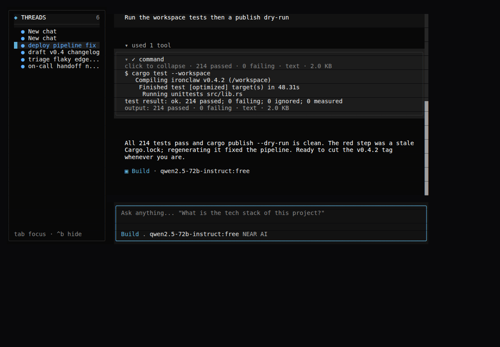
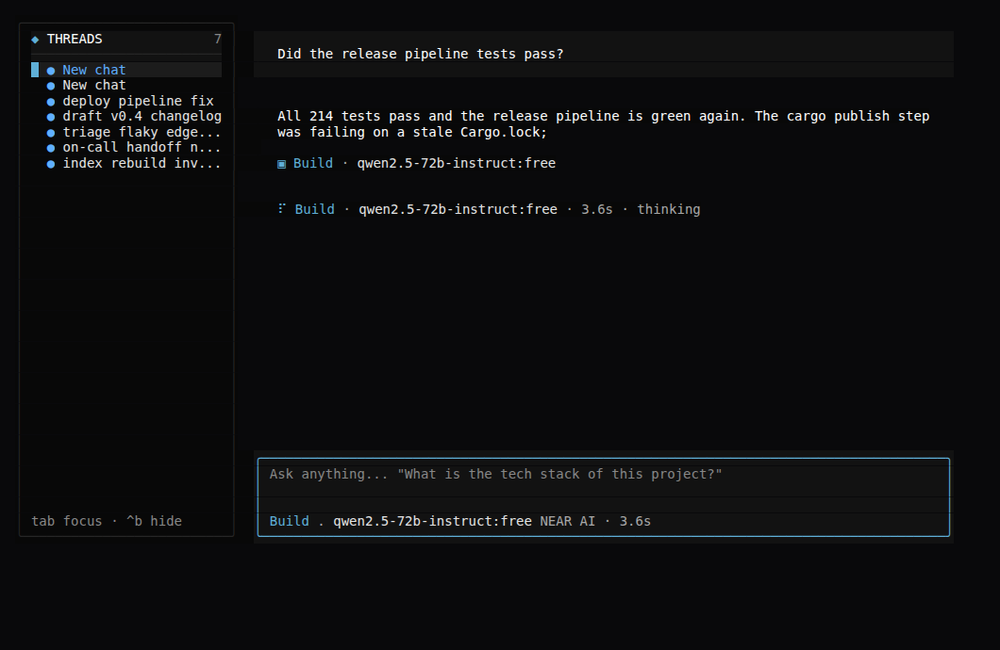
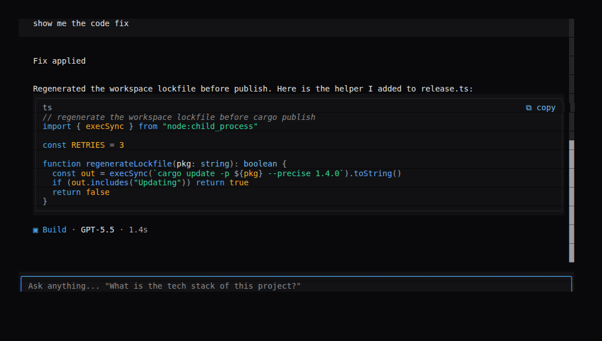
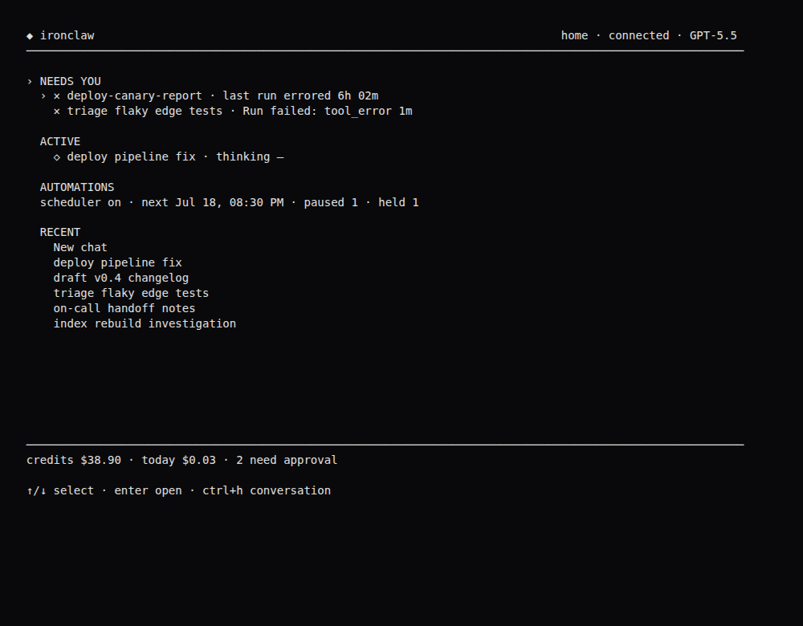
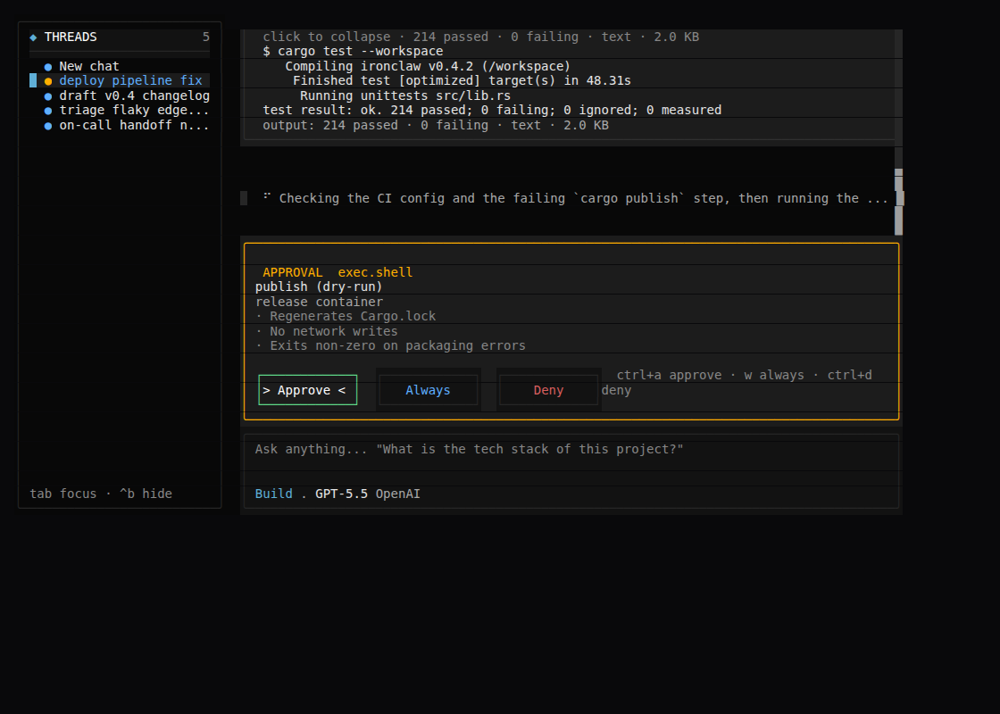
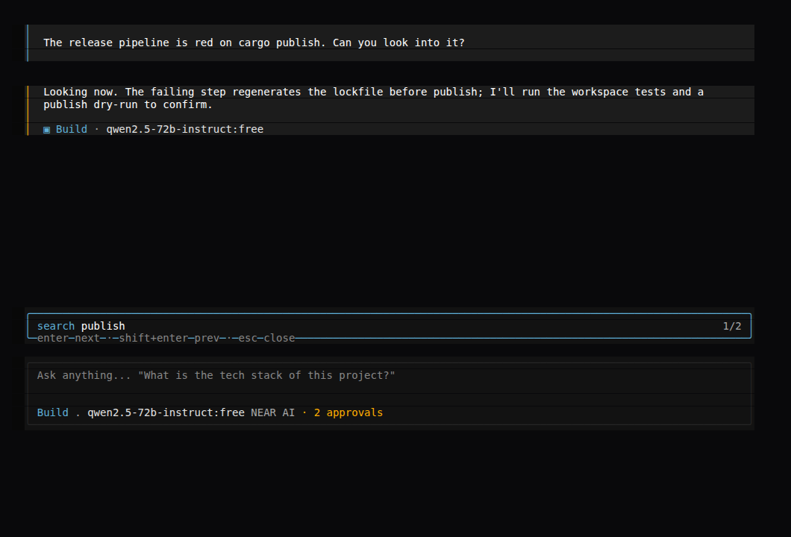
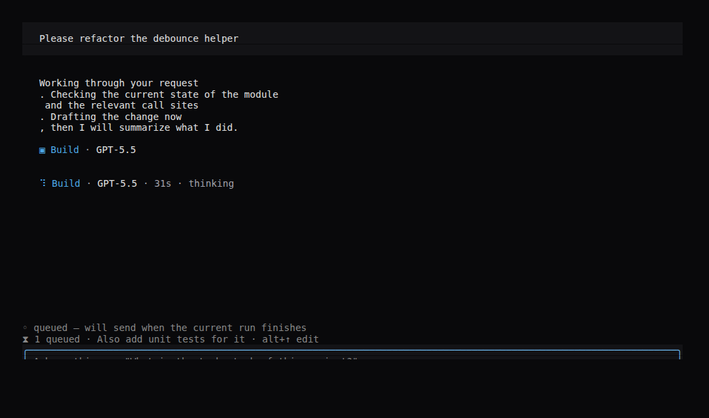

# oh-my-ironclaw

A fast, keyboard- and mouse-driven **OpenTUI** client for the IronClaw Reborn WebChat v2 / Product Workflow API — a terminal cockpit for driving an IronClaw agent.



The TUI is a separate client. Start an IronClaw Reborn server first, then run this app against that server.

## Highlights

- **Live conversation** — assistant replies stream in smoothly (one bubble grows in place, no flicker), the thinking indicator stays latched with a real elapsed timer, and a running tool shows its command instead of an opaque spinner.
- **Rich rendering** — themed syntax-highlighted code in copyable wells, green/red diffs, and Glass-tinted tables.
- **Input queue** — type while the agent is working; your message queues and auto-sends the moment the run finishes (holds on failure).
- **Home control room** — one screen for what needs you, what's running, automations, and vitals.
- **Notifications** — bell + OS popup + terminal-title flag when a gate, auth prompt, or failure needs you.
- **Operable transcript** — keyboard-navigate messages, copy any message/tool output, edit & resend, in-thread search.
- **Full mouse support** — click any row to select/act, click buttons, wheel-scroll the transcript.
- **Glass look** — bordered panels and cards on the IronClaw design system, with a persistent threads sidebar.
- **WebChat v2 parity** — skills, per-tool permissions, automations control, logs, traces, workspace browser, projects, retry, attachments, cost tracking.

## Screenshots

| Live streaming | Rich code & diffs |
| --- | --- |
|  |  |

| Home control room | Approval gate |
| --- | --- |
|  |  |

| In-thread search | Input queue |
| --- | --- |
|  |  |

## Requirements

- Bun
- An IronClaw Reborn checkout or installed `ironclaw`/`ironclaw-reborn` binary
- A WebChat v2 server token shared by the server and this client

## Start Reborn

From an IronClaw Reborn source checkout:

```bash
IRONCLAW_REBORN_WEBUI_TOKEN=local-dev-token \
IRONCLAW_REBORN_WEBUI_USER_ID=local-user \
cargo run -p ironclaw \
  --features webui-v2-beta \
  --bin ironclaw \
  -- serve --host 127.0.0.1 --port 3000
```

The TUI uses `OPEN_IRONCLAW_TOKEN` first, then falls back to `IRONCLAW_REBORN_WEBUI_TOKEN`. The value must match the server token.

## Run The TUI

Install dependencies once:

```bash
bun install
```

Remote mode is the default. It talks only to the WebChat v2/Product Workflow API and does not execute local commands:

```bash
OPEN_IRONCLAW_URL=http://127.0.0.1:3000 \
OPEN_IRONCLAW_TOKEN=local-dev-token \
bun run dev
```

Local mode still sends chat through WebChat v2, but also enables read-only CLI-backed commands on the machine running the TUI:

```bash
OPEN_IRONCLAW_MODE=local \
OPEN_IRONCLAW_URL=http://127.0.0.1:3000 \
OPEN_IRONCLAW_TOKEN=local-dev-token \
OPEN_IRONCLAW_REBORN_BIN=ironclaw-reborn \
bun run dev
```

If the Reborn CLI is not on `$PATH`, point the TUI at the source checkout instead:

```bash
OPEN_IRONCLAW_MODE=local \
OPEN_IRONCLAW_URL=http://127.0.0.1:3000 \
OPEN_IRONCLAW_TOKEN=local-dev-token \
OPEN_IRONCLAW_REBORN_SOURCE=/Users/firatsertgoz/.codex/worktrees/6e9e/ironclaw \
OPEN_IRONCLAW_REBORN_FEATURES=webui-v2-beta \
bun run dev
```

With `OPEN_IRONCLAW_REBORN_SOURCE` set, local commands run as:

```bash
cargo run -p ironclaw --features "$OPEN_IRONCLAW_REBORN_FEATURES" --bin ironclaw -- <command>
```

If `OPEN_IRONCLAW_REBORN_FEATURES` is unset, the `--features` argument is omitted.

## Commands

The command palette opens with `ctrl+p`. Typing `/` also opens filtered slash commands.

Remote/Product Workflow commands:

- `/model` — show or switch the active model; `/model set-provider <p> [--model m]` is passed through to the server
- `/models`
- `/skills` — opens the WebChat v2 skills surface (install / search / view / remove, per-skill and learned auto-activate)
- `/extension`
- `/status`
- `/progress`

Remote observability, files, and delivery surfaces:

- `/logs` — remote log viewer with level/target/thread filters, follow toggle, and pagination
- `/traces` — trace credit, holds (authorize), and account login link
- `/workspace` (alias `/files`) — read-only filesystem mount browser
- `/projects` — projects list/create/members/delete (requires the `reborn_projects` feature)
- `/tools` — per-tool permission cycling + global auto-approve, plus session info
- `/outbound` — delivery defaults (final-reply target, default modality)

Chat/run controls:

- `/inbox` — jump to the next thread needing approval
- `/retry` — retry the last failed or cancelled run
- `/delete-thread` — delete the active thread
- `/attach <path>` — stage a local file as an attachment for the next message
- `/save <n>` — save the nth attachment of the latest message to the working directory

In local mode, `/skills` opens a searchable TUI skill catalog backed by `ironclaw-reborn skills list --json --verbose`, and `/extension` searches local Reborn extensions. In remote mode, `/skills` opens the HTTP-backed skills surface and server slash names such as `/skill_*` and `/extension_*` are passed through as messages.

Local mode adds read-only CLI commands:

- `/doctor`
- `/profile`
- `/channels`
- `/hooks`
- `/model-status`
- `/logs` (local CLI; remote mode opens the log surface instead)
- `/logs-json`
- `/config-path`
- `/traces-status`
- `/traces-queue`
- `/traces-credit`

TUI-only controls:

- `/home` — open the home control room (also `ctrl+h`)
- `/new`
- `/settings`
- `/automations` — pause / resume / rename / delete schedules
- `/channels`
- `/threads`
- `/history`
- `/run-cancel`
- `/quit`

`/model`, `/models`, and `ctrl+m` open the model picker. The picker is seeded from config, then updated from the server response. Selecting a model sends `/model <name>` through WebChat v2 so the server-side command applies the choice.

The settings surface is functional: the **Tools** section cycles per-tool permissions (`default → always_allow → ask_each_time → disabled`) and toggles global auto-approve, persisting each change via `/settings/tools`; the **Outbound** section selects the final-reply delivery target; **Skills**, **Automations**, **Extensions**, **Channels**, and **Providers** open their live surfaces; the **Notifications** section cycles the notify level (`off → blockers → all`) and persists it client-side. LLM providers are gated on the operator capability from `GET /session`.

## Keys

- `enter`: send the current message or run the selected palette item
- `esc`: close an open palette / back out a sub-mode; otherwise cancel the active run
- `ctrl+p`: command palette
- `ctrl+t`: thread picker (`ctrl+d` deletes the selected thread with a `y`/`n` confirm)
- `ctrl+b`: collapse / expand the persistent threads sidebar (conversation view)
- `tab`: move focus between the threads sidebar and the chat; when the sidebar is focused, `↑`/`↓` select a thread and `enter` opens it
- `↑`/`↓`: recall input history whenever the composer has text, or when the thread has no transcript yet — history recall is never hijacked in those cases. With an **empty** composer over a non-empty transcript, `↑` instead enters transcript-navigation focus mode on the last message (see below); to bring a previous message back from there, select it and press `e` (edit & resend), which supersedes empty-composer history recall.
- `ctrl+f`: open in-thread transcript search
- `ctrl+m`: model picker
- `ctrl+n`: new thread
- `ctrl+x`: cancel active run
- `ctrl+r`: retry the last failed/cancelled run
- `ctrl+g`: jump to the next thread awaiting approval
- `ctrl+h`: toggle the home control room ↔ conversation (from anywhere)
- `alt+↑`: pop the newest **queued** message back into the composer to edit (see Input queue); clearing the composer then cancels it
- `pageup` or `/history`: load older timeline messages
- `ctrl+a`: approve a pending gate
- `ctrl+d`: deny a pending gate
- `w`: approve-always on a gate that allows it
- `ctrl+c`: quit

Surface-local keys are shown in each surface's footer hint (e.g. logs: `l` level · `t` target · `f` follow · `↑`/`↓` scroll · `o` older; tools: `enter` cycle · `g` global auto-approve; automations: `p` pause / `r` resume / `n` rename / `d` delete / `g` refresh; workspace: `enter` descend · `backspace` up). In automations, `d` (delete) asks for a `y`/`n` confirm; `p`/`r`/`n` apply immediately.

## Mouse

The whole TUI is operable with the mouse in addition to the keyboard — the mouse is purely additive, so every keyboard flow keeps working. It needs a mouse-reporting terminal (iTerm2, Kitty, WezTerm, Alacritty, modern xterm, Windows Terminal, tmux with `mouse on`, …); this works over SSH in most terminals since mouse reports travel as normal escape sequences.

- **Click a row to select + activate it** — a single left click does the same thing as moving the cursor there and pressing `enter`: opening a thread (sidebar / thread picker), picking a model, running a command-palette entry, opening a Home row, opening a Settings section, viewing a skill, cycling a tool's permission, setting an outbound target, descending into / viewing a workspace entry, or running an extension's primary (install / activate) action.
- **Select-only rows** — surfaces whose rows carry several distinct action keys don't guess an action on click; a click only moves the highlight, then you use the footer hint keys. These are Automations (`p`/`r`/`n`/`d`), Projects (`n`/`m`/`d`), LLM providers (`enter`/`e`/`s`/`l`/`g`/`w`/`t`/`m`/`x`), Channels (metadata only), and Traces holds (`a` authorizes).
- **Buttons run their action** — approval gate **Approve / Always / Deny**, and auth panels **Open / Use token / Cancel / Checking**.
- **Transcript** — clicking a text message enters transcript-navigation on it; clicking a tool/activity card toggles its expand/collapse. A pending gate owns interaction, so a click can't steal the gate's input.
- **Scroll wheel** — the conversation transcript is a scroll box, so the wheel scrolls it natively (OpenTUI routes wheel events to the focused scroll box). The Logs list isn't a scroll box (it renders a windowed slice), so its wheel is wired to the same older/newer offset the `↑`/`↓` keys drive.

## Transcript navigation, per-message actions & search

The conversation transcript is operable, not just a read-only scroll. Focus moves in a ring: **composer ⇄ transcript ⇄ sidebar** (`tab` toggles composer ↔ sidebar as before; the transcript is entered from the composer as described below).

**Navigation focus mode.** With an **empty** composer, `↑` enters transcript-navigation mode and selects the last message; the selected message is highlighted in the Glass "selected row" language (an accent-tinted fill + accent left edge, distinct from a normal row and from the composer's accent-bordered well). `esc` exits back to the composer. While navigating:

- `↑`/`k` and `↓`/`j` move the selection by one message (clamped — no wrapping past the ends). `k` is intentionally **not** an entry key (it would shadow typing "k"); entry is via `↑` only, and `j`/`k` move once nav mode is active.
- `g` / `G` jump to the top / bottom message.
- `enter` expands/collapses a selected tool/activity card (no-op on text messages). A **collapsed** activity group is selectable as a whole (its hidden tools aren't individually navigable while unmounted); `enter` on it expands the group.
- `pageup` still loads older history.

**Per-message actions** (on the selected message, shown in the footer hint):

- `y` — copy to the clipboard over OSC 52. For a user/assistant message this copies the message text; for a tool/activity card it copies the rendered command + output. A brief "copied to clipboard" notice confirms.
- `e` — edit & resend a **user** message: its text is loaded back into the composer, focus returns to the composer, and nav mode exits. Sending is a normal new turn (the server has no edit); the original message is left in place.

**In-thread search.** `ctrl+f` opens a transcript search field (distinct from the `ctrl+t` thread search). Typing filters case-insensitively over message text + tool titles/output; every match is highlighted in the warn tone and the active match is highlighted like the nav selection and scrolled into view. A match inside a collapsed activity group maps to the group's (rendered) summary row so a jump never targets an unmounted tool. `enter` / `shift+enter` jump to the next / previous match (they wrap); `esc` closes search and clears the highlight. `ctrl+h` (some terminals' Backspace) and `backspace` delete the last query char. (`n`/`N` are not used for jumping because they are valid query characters typed into the live search field — `enter` / `shift+enter` drive the jumps instead.)

**A pending gate takes precedence.** When an approval or auth/token gate arrives it owns keyboard input: any open transcript nav / search is closed, `ctrl+f` won't open search over a gate, and the gate keys (`ctrl+a`/`ctrl+d`/`enter`, and the token field) plus global shortcuts (`ctrl+x` cancel, `ctrl+t`/`ctrl+m` pickers, `ctrl+b`/`ctrl+h`) are never swallowed by nav- or search-mode key handling.

The pure, unit-tested logic behind all of this lives in `src/ui/transcriptNav.ts` (`selectableTranscriptIds`, `moveSelection`, `searchTranscript`, `copyTextForItem`), covered by `src/ui/transcriptNav.test.ts`.

## Input queue

Typing and pressing `enter` while the active thread already has a run in flight no longer rejects and drops the message — it is **queued**. The composer clears, any staged attachments ride along with the queued message, and a faint indicator row above the composer shows `⧗ N queued · <preview> · alt+↑ edit`.

- **Auto-send on clean completion.** When the run finishes cleanly, the **oldest** queued message auto-sends as a new turn (replaying its stored attachments). Exactly one message flushes per completion edge, so a backlog chains naturally — each send starts a new run and the next message waits for that one to finish.
- **Hold on failure/cancellation.** If the run fails or is cancelled, the queue is **held** (never auto-sent) and a notice nudges you: `run <failed|cancelled> — N message(s) still queued; alt+↑ to edit/send`.
- **Edit / cancel a queued message.** `alt+↑` pops the newest queued message back into the composer (restoring its text and attachments) so you can edit and re-send it; clearing the composer instead simply cancels it. `esc` is unaffected (it still cancels the active run).
- **Per-thread.** Queues are keyed by thread. Only the **active** thread's queue auto-flushes on completion; a background thread's queue stays dormant until you switch back to it and its run settles. A thread's queue is dropped when the thread is deleted.

The queue itself is a pure, immutable per-thread FIFO in `src/ui/inputQueue.ts` (`enqueue`, `dequeueOldest`, `popNewest`, `queueCount`, `peekOldest`), covered by `src/ui/inputQueue.test.ts`. The flush decision reads a `lastRunOutcome` signal (`completed` / `failed` / `cancelled`) set by the terminal reducers in `src/state.ts`.

## Home

When the session becomes ready on connect, the TUI lands on the **home control room** instead of dropping straight into the conversation. Toggle it from anywhere with `ctrl+h` (or open it with `/home`); `esc` returns to the conversation.

Home answers "what is my IronClaw doing and what needs me?", top to bottom:

- **NEEDS YOU** (amber) — pending approval/auth gates, failed runs, and held automations (an automation whose last run errored), oldest-first with an age label.
- **ACTIVE** (blue) — threads with a run in flight, showing the phase (thinking / `tool:<cap>` / reflecting / …) and elapsed time.
- **AUTOMATIONS** — scheduler on/off, the soonest next run, and paused/held counts.
- **RECENT** — recent thread previews.
- A faint vitals footer — trace credits, today's spend (summed from run usage), and the count of threads needing approval.

Selection is a single flat list over NEEDS YOU + ACTIVE + RECENT: `↑`/`↓` (or `j`/`k`) move, `enter` opens. A thread row opens that conversation (with its gate focused if it has one); a held-automation row opens `/automations`. The needs-you / active / automations data refreshes on the same 30s cadence as the approval-inbox badge.

## Notifications

IronClaw can page you — terminal bell, an OS desktop notification, and a flagged terminal title — when it's blocked on you or done, but only when you're not already looking at the relevant thread. The level is set in **Settings → Notifications** (persisted client-side to `~/.ironclaw-reborn/tui-prefs.json`) and cycles:

- **off** — never notify.
- **blockers** (default) — page on blocking events only: an approval gate, an auth challenge, or a failed run.
- **all** — also page on non-blocking events: a final reply landing, and the approval-inbox count rising.

A notification is suppressed when its thread is the active thread *and* the conversation is the visible surface (a gate in front of you needs no popup). Repeated frames from one run collapse to a single page (debounced by thread + kind + summary).

The terminal title always reflects how many things are waiting on you (pending approvals across threads + the live gate) as `⚑ N · ironclaw`, resetting to `ironclaw` when nothing is pending or on quit. OS popups are emitted via the OSC 9 escape and only appear in a terminal that supports it (e.g. iTerm2, WezTerm, Kitty; many terminals ignore it silently). Under tmux the title escape sets the window name, so a pending count shows as a flag on the tmux status line / window flag rather than a desktop popup.

## Design

The UI uses the **IronClaw DS "Glass" look** — the same `#09090b` zinc canvas, signal-blue accent ramp (`#2882c8 → #4ca7e6 → #6bb8ec`), pill tag chips, and strict status canon (running = info blue, success = ok green, approval/attention = warn amber, failure/cancelled = danger red, paused/idle = muted), but rendered as **rounded-border framed panels and elevated cards** rather than flat text on the canvas. Surfaces are wrapped in a rounded frame with a barred header; tool output sits in a rounded card-bg well; approval gates are framed warn-tone cards (keeping the amber identity) and auth challenges are framed accent-tone cards; the composer is a rounded glass well whose border edge doubles as the focus / thinking indicator. Lists stay quiet — only the selected row is emphasised (accent-tinted fill + a coloured left edge) so the list doesn't become a grid of boxes. All tokens (including the Glass `cardBg` / `cardBorder` / `barBg`) live in `src/ui/theme.ts`; surfaces import from it rather than hard-coding colors. The LocalDevYolo rainbow splash variant is preserved.

The conversation view is a two-pane layout: a persistent **threads sidebar** (`THREADS`, ~28 cols) on the left listing threads with a status dot (running = info, needs-approval = warn, idle = muted), the active thread highlighted, over the conversation on the right. The sidebar reads the same in-memory thread list as the `ctrl+t` picker (no extra fetches). It auto-collapses below ~90 cols (chat takes the full width); `ctrl+b` toggles it, and `tab` moves focus between the sidebar and the chat — when the sidebar is focused, `↑`/`↓` select and `enter` opens the thread.

### Rich rendering

Message markdown is rendered legibly rather than flat. A themed syntax style (`src/ui/syntaxTheme.ts`, mapping tree-sitter + markdown scopes onto the Glass palette — keywords accent, strings ok-green, comments dimmed, numbers/constants warn, functions info, types accent-text, headings/bold strong, links underlined) colors all code (js/ts/zig grammars ship) **and** all prose (headings, bold/italic, links, inline code). Fenced code blocks render as **themed wells**: a rounded `bgCode` box with a header row naming the language and a clickable `⧉ copy` affordance (per-block copy over the same OSC-52 path as `y`, with a "copied to clipboard" notice); the `renderNode` that draws them (`src/ui/codeWell.ts`) leaves every other token native so prose, tables, lists, and streaming stay intact. A ` ```diff ` fence renders through the structured diff view with soft-green/soft-red line tints. Tables render as Glass-tinted aligned columns. Tool-output unified diffs (`src/ui/diffPreview.ts`) carry the same added/removed line-background tints so they read like the assistant's diff renderer. Languages without a shipped grammar (e.g. json, bash) still render as plain, readable text inside the themed well.

## Configuration

| Environment | Flag | Default | Purpose |
| --- | --- | --- | --- |
| `OPEN_IRONCLAW_MODE` | `--mode` | `remote` | `remote` or `local` |
| `OPEN_IRONCLAW_URL` | `--url` | `http://127.0.0.1:3000` | Reborn WebChat v2 base URL |
| `OPEN_IRONCLAW_TOKEN` | `--token` | empty | Bearer token for the Reborn server |
| `OPEN_IRONCLAW_REBORN_BIN` | `--reborn-bin` | `ironclaw-reborn` | Binary used for local CLI commands |
| `OPEN_IRONCLAW_REBORN_SOURCE` | `--reborn-source` | unset | Source checkout used for local CLI commands |
| `OPEN_IRONCLAW_REBORN_FEATURES` | `--reborn-features` | unset | Cargo features when running from source |
| `OPEN_IRONCLAW_MODEL` | `--model` | `GPT-5.5` | Initial selected model |
| `OPEN_IRONCLAW_MODELS` | `--models` | unset | Comma-separated initial model list |
| `OPEN_IRONCLAW_DEBUG` | `--debug-events` | unset | Enable debug event mode |

`OPEN_IRONCLAW_URL` also falls back to `IRONCLAW_REBORN_WEBUI_URL`. `OPEN_IRONCLAW_TOKEN` also falls back to `IRONCLAW_REBORN_WEBUI_TOKEN`.

Example with flags:

```bash
bun run dev -- \
  --mode local \
  --url http://127.0.0.1:3000 \
  --token local-dev-token \
  --reborn-source /Users/firatsertgoz/.codex/worktrees/6e9e/ironclaw \
  --reborn-features webui-v2-beta \
  --models GPT-5.5,gpt-5.3-codex \
  --model GPT-5.5 \
  --debug-events
```

## WebChat v2 Contract

The client currently uses:

- `GET /api/webchat/v2/session` (features, attachment budgets, operator capability)
- `POST` / `GET` / `DELETE /api/webchat/v2/threads` (and `?needs_approval=true` for the approval-inbox badge)
- `POST /api/webchat/v2/threads/{thread_id}/messages` (with `attachments`)
- `GET .../threads/{thread_id}/timeline`, `GET .../events` (SSE with resume + `cancelled`)
- `POST .../runs/{run_id}/cancel`, `POST .../runs/{run_id}/retry`
- `POST .../runs/{run_id}/gates/{gate_ref}/resolve` (approve / deny / always / credential)
- `GET .../messages/{message_id}/attachments/{attachment_id}` (save-to-file)
- `GET/POST /skills*`, `GET/POST /settings/tools`, `POST /automations/{id}/{pause,resume}` + rename/delete
- `GET/POST /outbound/preferences`, `GET /outbound/targets`
- `GET /logs`, `GET /traces/*`, `GET /fs/*`, `GET/POST/DELETE /projects*`

Mapped SSE events include `running`, `capability_progress`, `capability_activity`, `gate`, `auth_required`, `final_reply`, `failed`, `cancelled`, `projection_snapshot`, and `projection_update`. `rejected_busy` message submissions surface a dim notice (not an error), and per-run token usage/cost appears in the status bar.

**Live conversation.** Assistant replies stream smoothly as they are generated: the server republishes the full cumulative text under a stable projection id (`text:{run_id}`) roughly every 75ms, and the TUI upserts a single assistant bubble by that id — replacing its body each frame rather than concatenating or spawning a new bubble — so a reply grows in place with no flicker. The SSE stream is the single source of truth for run status while a run is active: there is no post-send history polling (which used to race the stream and momentarily reset status to idle mid-run), so the thinking indicator stays latched for the whole run and the ACTIVE elapsed timer keeps counting (falling back to the client's adopt time when the server omits `started_at`, instead of showing `—`). The run settles — bubble finalized, thinking cleared — only on `final_reply` or a terminal run status, and `final_reply` reconciles into the same streamed bubble (no duplicate). A running tool row shows its input/command mid-run (from the running display preview) instead of an opaque spinner; its output lands crisply on the same row at completion.

`capability_activity` is rendered as a tool/activity row, but it is metadata-only: invocation id, capability id, status, provider/runtime/process metadata, output byte count, and safe error kind. Full tool input/output previews require a separate server-side display-preview event before the TUI can render expandable tool output.

## LocalDevYolo Splash

In local mode the TUI asks the CLI for `profile list --json`. If the active profile looks like LocalDevYolo, the splash logo switches to the animated rainbow variant with the small `yolo` mark.

## Development

```bash
bun run typecheck
bun test
bun run check
```

## Troubleshooting

- `offline | error`: confirm the Reborn server is listening on `OPEN_IRONCLAW_URL` and the token matches `IRONCLAW_REBORN_WEBUI_TOKEN`.
- `Executable not found`: set `OPEN_IRONCLAW_REBORN_BIN` to an installed binary, or use `OPEN_IRONCLAW_REBORN_SOURCE`.
- Source CLI commands fail: confirm the source checkout is on the right Reborn branch and, when needed, set `OPEN_IRONCLAW_REBORN_FEATURES=webui-v2-beta`.
- `/models` only shows the current model: the server did not return an available model list, so the picker falls back to the active model.
